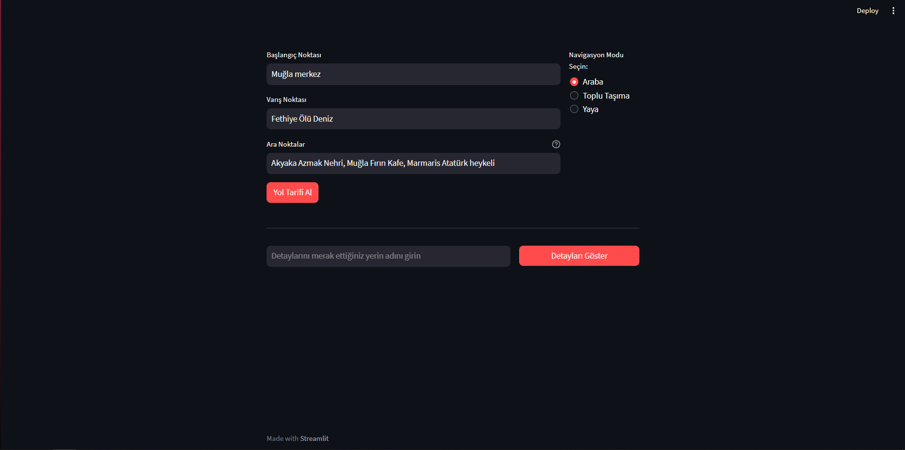
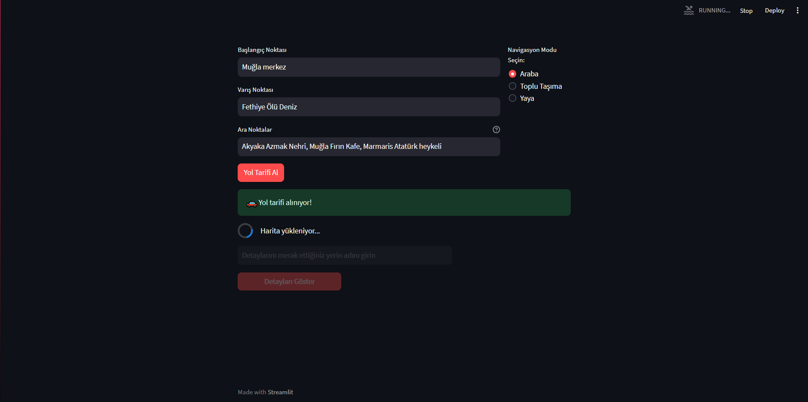
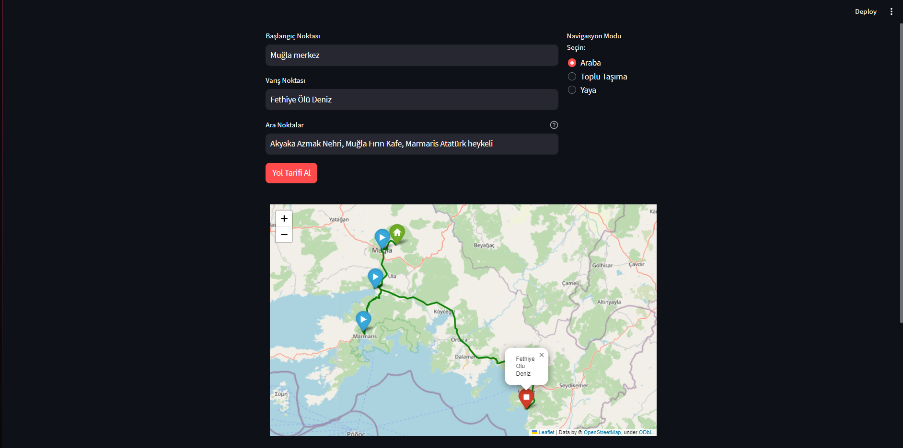
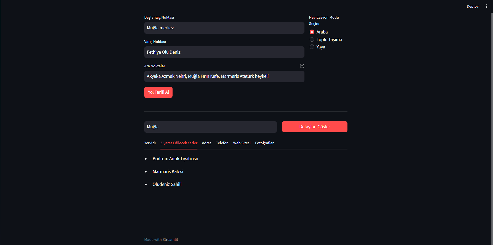

# Journey-Ease: Smart Route Planning Application

Journey-Ease is a smart route planning application that consolidates three different Google services and additional features into a single platform.

## Features

- **Flexible Route Specification:** Yolbul allows users to specify points on their journey, offering 100% flexibility in route planning.

## Technologies

This project has been developed using the following technologies:

- [Streamlit](https://streamlit.io/): A Python library used for creating web applications.
- [Google API](https://developers.google.com/maps/documentation): Provides access to Google Maps services.
- [Folium](https://python-visualization.github.io/folium/): A Python library used for creating map visualizations.
- [Python](https://www.python.org/): The primary programming language used in the project.

## How to use
Please ensure your environment aligns with the specified versions of dependencies (Streamlit, Google API, Folium, Python) to avoid potential issues.
1. Clone the project.
2. Install the necessary dependencies
3. After giving the required permissions, save your Google API key in 'key.txt'.
4. Start the application by running the following command in the terminal:


```python
streamlit run app.py
```

## Screenshots








